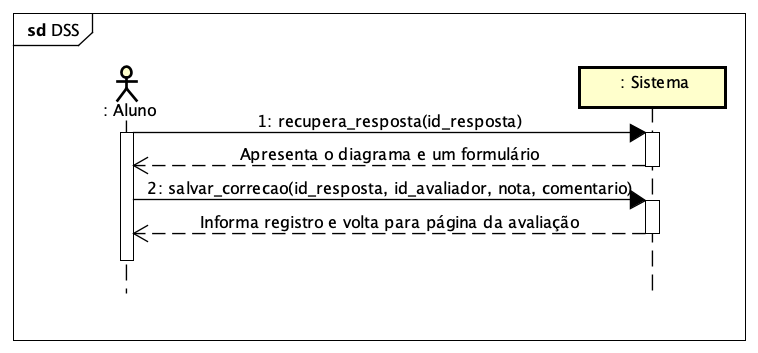

# CDU011. Avaliar trabalho de colega 

- **Ator principal**: Aluno (avaliador)
- **Atores secundários**: (nenhum)
- **Resumo**: Um aluno recebe a incumbência de avaliar o diagrama submetido por um colega de turma, para o qual irá registrar uma nota e um opcionalmente um comentário.
- **Pré-condição**: 
  - aluno (avaliador) logado no sistema;
  - trabalho submetido corretamente na janela de submissão;
  - jenala de correção aberta pelo professor.
- **Pós-Condição**: 
  - avaliação do trabalho submetida e persitida. 

## Fluxo Principal
| Ações do ator | Ações do sistema |
| :-----------: | :--------------: | 
| 0 - Na página de uma avaliação específica, é apresentado ao aluno (logado) um link para que ele possa avaliar o trabalho de um colega (sem identificação) | |  
| 1 - Aluno clica no link para avaliar o trabalho |  |
|  | 2 - Sistema exibe o diagrama a ser avaliado e um formulário contendo os campos nota e comentário |
| 3 - Avaliador preenche o formulário e submete a avaliação |  |
|  | 4 - Sistema informa que a avaliação foi registrada com sucesso ao retornar para a página inicial da avaliação |

## Fluxo Alternativo I - Avaliador não informa a nota
| Ações do ator | Ações do sistema |
| :-----------: |:---------------: | 
|  | 4.1 - Sistema informa que a nota é inválida e exibe novamente a tela de submissão de correção (retorna ao passo 2 do fluxo principal) |

## Fluxo Alternativo II - Avaliador informa nota negativa ou maior que 100
| Ações do ator | Ações do sistema |
| :-----------: | :--------------: | 
| | 4.2 - Sistema informa que a nota precisar estar entre 0 e 100 e exibe novamente a tela de submissão de correção (retorna ao passo 2 do fluxo principal) |  

## Diagramas de Interação (Sequência)

### DSS

### Sequência - Etapa 1

### Sequência - Etapa 2

## Diagrama de Classes de Projeto

