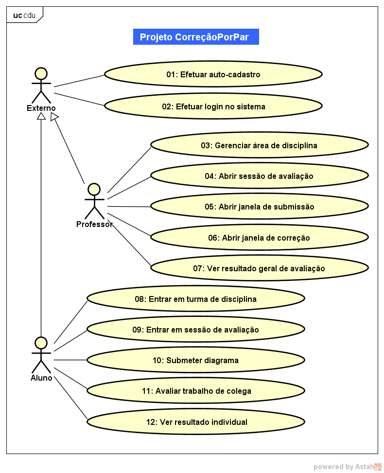

# Modelo de Casos de Uso

## 1. Diagrama de Casos de Uso

## 2. Listagem dos detalhamentos dos casos de uso

1. [CDU-004 - Abrir sessão de avaliação](cdu-004/detalhamento-004.md)
1. [CDU-010 - Submeter diagrama (como resposta)](cdu-010/detalhamento-010.md)
1. [CDU-011 - Avaliar trabalho de colega](cdu-011/detalhamento-011.md)